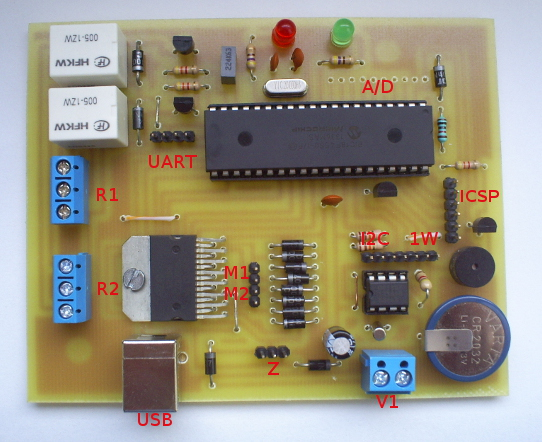

# TTMSB USB

**Test and control board for PIC18F4550**, including PCB design and firmware written in **CCS C Compiler (CCSC)**.

The board communicates via **USB (virtual COM port)** or **UART**, allowing control and monitoring of several peripherals.

---

## Features

- Control of **two DC motors**
- Switching **two high-power devices (relays)**
- **Temperature sensing** using a digital or analog sensor
- **Real-Time Clock (RTC)** for maintaining current time even when powered off
- **Sound signaling** (buzzer or speaker)
- Communication via **USB CDC (virtual UART)** or **hardware UART**

---

## UART Configuration

| Parameter     | Value     |
|----------------|-----------|
| Baud rate      | 115200 bps |
| Data bits      | 8         |
| Parity         | None      |
| Stop bits      | 1         |
| Flow control   | Hardware  |

---

## USB / UART Commands

The board listens for **single-character commands** over USB or UART.

| Command | Function |
|----------|-----------|
| `s` | Sound signal (buzzer) |
| `m` | Toggle relay 1 ON/OFF |
| `n` | Toggle relay 2 ON/OFF |
| `t` | Read temperature |
| `l` | Motor left |
| `r` | Motor right |
| `d` | Motor down / backward |
| `u` | Motor up / forward |
| `y` | Read time from RTC |
| `a` | Sync RTC with local (PC) time |
| `o` | Set RTC manually |
| `p` | Test routine |
| `x` | Reset microcontroller (CPU) |

---

## Hardware Overview

- **Microcontroller:** PIC18F4550  
- **USB interface:** Full-speed USB 2.0 via internal PIC module  
- **Power supply:** USB-powered or external (5 V)  
- **Clock:** 20 MHz crystal (configured for USB)  
- **I/O:**  
  - 2× DC motor driver channels  
  - 2× relay outputs  
  - 1× temperature sensor input  
  - 1× RTC module (e.g., DS1307/DS3231)  
  - 1× buzzer  

---

## Development

- Firmware written in **CCS C** (`.c` and `.h` sources)  
- Compatible with **MPLAB IDE** or **CCS IDE**  
- Simple serial command protocol for debugging and control  
- Supports firmware updates via ICSP  

---

## License

This project is open hardware and software under the **CC BY-SA** license.  
You are free to reproduce, modify, and share this project with attribution.

---

© 2013 Marcin Filipiak

